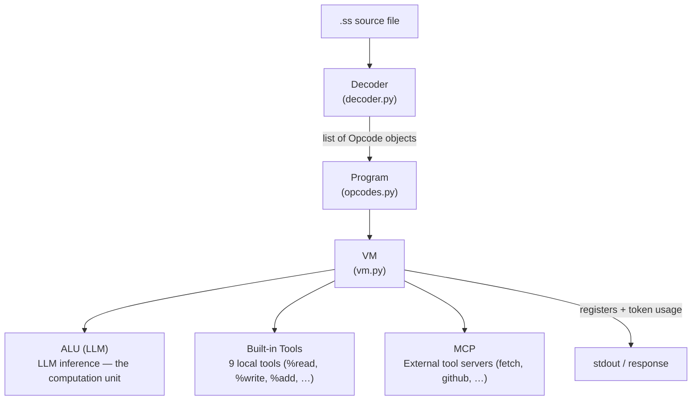
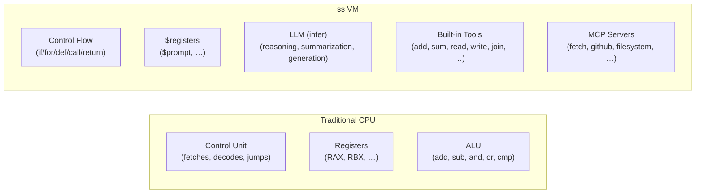

# Architecture

## Pipeline



## The Model as ALU

A traditional CPU has an **ALU** (Arithmetic Logic Unit) that performs computation —
addition, bitwise ops, comparisons. In ss, the **LLM is the ALU**.



The key design principle: **the LLM never makes control-flow decisions**. It generates
content (strings, JSON, code) and writes results to registers. The `.ss` script's
`if`/`for`/`def`/`return` structures determine what runs next — the LLM is purely
a data transformer.

```mermaid
flowchart LR
    subgraph CF["Control Flow (ss script)"]
        Loop["for each $item<br/>in $results:"]
        Infer["$summary = infer ..."]
        End["end"]
        Final["$final = infer ..."]
    end
    subgraph D["Data (registers)"]
        R1["$results"]
        R2["$summary"]
        R3["$answer"]
    end
    subgraph C["Computation (LLM)"]
        LLM['infer "extract key facts<br/>from $results"']
    end

    Loop -.-> R1
    Loop --> Infer
    Infer --> R2
    R1 --> LLM
    LLM --> R2
    Final -.-> R3
```

## Opcodes

15 opcode types defined in `src/ss/opcodes.py:6-21`.

| Opcode       | Code     | Description |
|--------------|----------|-------------|
| `ASSIGN`     | `$x = y` | Store a literal or evaluated expression into a register |
| `CALL`       | `%tool` / `%server.name` | Call a built-in tool, MCP tool, skill, or loaded skill; optionally store result |
| `INFER`      | `infer "prompt $reg"` | Send prompt to the LLM, store response in a register |
| `RECOMMEND`  | `$x = recommend << END ... END` | Declarative retrieval — parse XML-like block, apply structural filters, LLM ranking/selection |
| `LOOP`       | `for each $item in $list:` | Iterate over a list register |
| `END`        | `end` | End of a `def`/`if`/`else`/`for` block |
| `IF`         | `if condition:` | Conditional branch — jump to `ELSE`/`END` if falsy |
| `ELSE`       | `else:` | Unconditional jump to matching `END` |
| `JUMP`       | *(reserved)* | Unconditional jump (unused) |
| `JUMPIF`     | *(reserved)* | Conditional jump (unused) |
| `DEF`        | `def name $params:` | Define a skill — skips body to matching `END` |
| `RETURN`     | `return $val` | Return from skill — pops call stack, restores registers |
| `IMPORT`     | `import name from source` | Launch an MCP server subprocess |
| `LOAD_SKILL` | `load skill path as alias` | Load an external `.ss` skill directory |
| `HALT`       | *(implicit)* | Stop VM execution |

### Opcode execution (`src/ss/vm.py:145-420`)

- **ASSIGN**: Evaluate RHS (resolve `$reg` refs, string interpolation, JSON) → store in register
- **CALL**: Dispatch by name — skill (push call frame), MCP tool (JSON-RPC), loaded skill (subprocess), or built-in
- **INFER**: Interpolate prompt → call LLM → store result in register. Falls back to deterministic mock for "location" prompts
- **RECOMMEND**: Parse XML-like block (`<from>`, `<match>`, `<reject>`, structural filters, `<rank>`, `<limit>`) → collect items from source registers → apply structural filters programmatically → use LLM for semantic matching and ranking → apply limit → store result in register
- **IF**: Evaluate condition → jump to `ELSE`/`END` if falsy
- **ELSE**: Unconditional jump to matching `END` (skips else-block when if-block already ran)
- **LOOP**: Maintain loop state on `loop_stack` — iterate list, set item register, jump back after body
- **DEF**: Skip to matching `END` (body is entered via `CALL`)
- **RETURN**: Pop call stack, restore registers, jump to return address
- **END**: If matching start was `LOOP`, jump back; otherwise fall through
- **IMPORT**: Launch MCP server subprocess, register in `import_registry`
- **LOAD_SKILL**: Load `.ss` skill manifest, populate `$alias_instructions` and `$alias_meta` registers
- **HALT**: Set `halted = True`, exit run loop

## Built-in Tools

Defined in `src/ss/vm.py:227-287`. Called via `%name` syntax.

| Tool | Args | Returns | Description |
|------|------|---------|-------------|
| `%append` | `$list $item` | list | Append item to an in-memory list register (mutates in place) |
| `%read` | `$path` | string | Read file contents |
| `%append_to_file` | `$path $content` | bool | Append content (string + newline) to a file |
| `%write` | `$path $content` | bool | Overwrite a file with content |
| `%urlencode` | `$string` | string | URL-encode a string |
| `%join` | `$list [$sep]` | string | Join list items with separator (default `\n`) |
| `%add` | `$a $b` | float | Add two numbers |
| `%sum` | `$list` | float | Sum all items in a list |
| `%list_files` | `$dir` | list | List files (not dirs) in a directory — returns full paths |

## VM Internals

The VM (`src/ss/vm.py`) maintains several runtime structures:

| Structure | Type | Purpose |
|-----------|------|---------|
| `registers` | `Dict[str, Any]` | All program data — `$name → value` |
| `call_stack` | `List[Dict]` | Skill call frames — `return_ip`, `target_register`, `old_registers` |
| `loop_stack` | `List[Dict]` | Loop iteration state — `ip`, `items`, `index`, `item_var` |
| `jump_targets` | `Dict[int, int]` | Pre-computed block start → end mappings (for `if`/`else`/`for`/`def`) |
| `import_registry` | `Dict[str, str]` | MCP server name → source mapping |
| `skills` | `Dict[str, Dict]` | User-defined skills — `name → {params, start_ip}` |
| `loaded_skills` | `Dict[str, LoadedSkill]` | Externally loaded `.ss` skill directories |
| `token_usage` | `List[Dict]` | Per-inference `{prompt, completion, total}` token counts |

### Expression evaluation

The `evaluate()` method (`src/ss/vm.py:88-137`) handles values in opcode parameters:

- **`$register` references**: resolved from `self.registers`
- **JSON arrays/objects**: parsed with `json.loads`
- **Integers and floats**: parsed directly
- **Booleans**: `true`/`false` → Python `True`/`False`
- **Strings with interpolation**: `"... $reg ..."` — `$reg` replaced with register value
- **Call args**: `key=value` pairs parsed as named args, positional otherwise

## Decoder (`src/ss/decoder.py`)

Two-tier parsing:

1. **Regex first** — structural lines (`def`, `if`, `for`, `return`, `import`, `load`, `end`, `else:`, assignments, `%` calls, `infer`)
2. **LLM fallback** — "vibe" lines not matched by regex are sent to the LLM with a structured output prompt; returns JSON opcodes

Vibe lines use the `DECODER_PROMPT` template from `src/ss/prompts.py` which describes the full opcode schema and examples.

## MCP Integration (`src/ss/mcp.py`)

MCP (Model Context Protocol) servers are launched as subprocesses and communicate via JSON-RPC over stdin/stdout:

- **uvx sources**: `uvx://package` — installed via uv
- **npx sources**: `npx://package` — installed via npm
- **JSON config**: `mcp_servers.json` — local tool definitions

Tools are called with named arguments: `%server.tool key=value`. The decoder detects `=` in arguments and passes them as a named dict.

## Debug Support (DAP)

The VM implements the Debug Adapter Protocol (`src/ss/dap_server.py`):

- Breakpoints by source line number
- Step Over / Step In / Step Out
- Register inspection
- Call stack view
- Pause / Continue

Runs the VM in a separate thread so the debug server can receive commands while execution is paused.
