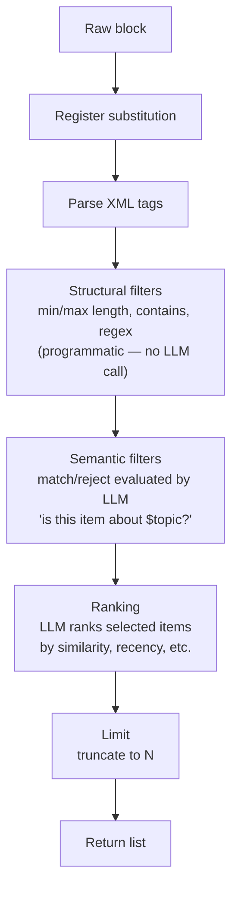

# `recommend` Block

A declarative retrieval sub-language embedded in `.ss` scripts via heredoc or inline strings. You declare sources, constraints, and ranking; the runtime satisfies them. Same concepts as Datalog — source facts, composable rules, a query clause — expressed in XML-like syntax that models parse reliably.

`infer` generates. `recommend` selects. They compose.

---

## Embedding

**Heredoc** (preferred for multi-line blocks):

```ss
$result = recommend << END
<from>$chunks</from>
<match>answers $question</match>
<limit>5</limit>
END
```

The marker after `<<` is user-defined (`END` by convention). The block ends when that marker appears on its own line.

**Inline quoted** (for single-line blocks):

```ss
$result = recommend "<from>$chunks</from><match>relevant</match><limit>3</limit>"
```

`$registers` from the outer `.ss` scope are available anywhere inside the block. The block returns a ranked list (or a single item if `limit="1"`).

---

## Execution Pipeline



**Key principle**: structural filters are applied programmatically first (fast, deterministic), then only the survivors are sent to the LLM for semantic evaluation and ranking.

---

## Flat Form

For straightforward queries — one source, conditions, ranking:

```xml
<from>$chunks</from>

<match>about $topic</match>
<match>answers $question</match>
<reject>generic_filler</reject>
<min length="80"/>

<rank by="similarity" context="$question"/>
<limit>5</limit>
```

### Tags

**`<from>`** — source collection. Multiple `<from>` tags form a union.

```xml
<from>$web_results</from>
<from>$local_docs</from>
```

Values are resolved from VM registers. Lists are merged directly; strings are parsed as JSON if possible.

**`<match>`** — semantic predicate evaluated by the LLM. No fixed vocabulary.

```xml
<match>answers $question</match>
<match>supports the claim that $thesis</match>
<match>written by a domain expert</match>
```

**`<reject>`** — negated semantic predicate. Excludes items that satisfy it.

```xml
<reject>generic filler or boilerplate</reject>
<reject>redundant with $already_seen</reject>
```

**Structural filters** — evaluated programmatically, no LLM call:

```xml
<min length="100"/>
<max length="2000"/>
<contains>$keyword</contains>
<matches>[Bb]oilerplate</matches>
```

`<contains>` checks substring presence. `<matches>` uses Python regex.

**`<rank>`** — scoring function over the filtered candidate set.

Attribute form:

```xml
<rank by="similarity" context="$question"/>
```

The `by` and `context` values are passed to the LLM as the ranking criterion.

Block form (passed verbatim to the LLM):

```xml
<rank>
  <score weight="0.7">similarity $question</score>
  <score weight="0.3">recency</score>
</rank>
```

**`<limit>`** — maximum items to return.

```xml
<limit>5</limit>
```

---

## Composed Form

For layered criteria, use named `<rule>` elements. Rules reference each other via `<extends>`. This is the Datalog part: derived predicates from base ones.

```xml
<from>$chunks</from>

<rule id="on_topic">
  <match>about $topic</match>
</rule>

<rule id="usable">
  <extends>on_topic</extends>
  <match>answers $question</match>
  <reject>generic_filler</reject>
  <min length="80"/>
</rule>

<select rule="usable" rank="similarity $question" limit="5"/>
```

`<select>` replaces the flat `<rank>` and `<limit>` tags when using composed rules. Its attributes: `rule`, `rank`, `limit`.

Multiple `<extends>` tags are conjunction — the item must satisfy all parent rules:

```xml
<rule id="good">
  <extends>on_topic</extends>
  <extends>substantive</extends>
  <reject>contradicts $known_facts</reject>
</rule>
```

Rules inherit predicates through the extends chain (preventing cycles).

---

## Full Example

```ss
$raw    = %fetch.fetch url="https://lite.duckduckgo.com/lite/?q=$encoded" max_length=12000
$chunks = infer "Split these search results into individual passages as a list: $raw"

$hits = recommend << END
<from>$chunks</from>

<rule id="relevant">
  <match>about $topic</match>
  <match>answers $question</match>
</rule>

<rule id="quality">
  <extends>relevant</extends>
  <reject>generic filler or boilerplate</reject>
  <min length="80"/>
</rule>

<select rule="quality" rank="similarity $question" limit="5"/>
END

$answer = infer "Answer $question using only this material: $hits"
```

---

## Composition with `infer`

The natural pipeline: `recommend` narrows the candidate space, `infer` generates from the result.

```ss
# narrow then synthesize
$evidence = recommend << END
<from>$corpus</from>
<match>supports $thesis</match>
<reject>tangentially related</reject>
<select rank="similarity $thesis" limit="6"/>
END
$draft = infer "Write an argument for $thesis grounded in: $evidence"

# narrow then join into context window
$passages = recommend << END
<from>$paragraphs</from>
<match>directly answers $question</match>
<match>contains specific details or data</match>
<limit>4</limit>
END
$context = %join $passages "\n---\n"
$answer  = infer "Answer $question. Context: $context"
```

---

## Implementation Notes

| Aspect | Detail |
|--------|--------|
| Decoder | Regex-based (`_decode_regex`) — handles both heredoc and inline forms. No LLM fallback needed. |
| Preprocessing | `preprocess_lines()` combines heredoc blocks before line-by-line decoding. |
| Structural filters | Applied in Python (no LLM call): min/max length, substring contains, regex matches. |
| Semantic predicates | Sent to the LLM as a single prompt with all candidates and criteria; LLM returns selected indices as JSON. |
| Ranking | Same LLM call as semantic filtering — the LLM both selects and ranks items. |
| Model | Uses the same model as `infer` from `config.toml`. A different model/reranker can be wired in by replacing the `_execute_recommend` method. |
| Token tracking | LLM calls during recommend are logged in `vm.token_usage`. |
| `<after>` / `<before>` | Date-based filters are reserved for future implementation. |

---

## Relation to `infer`

| | `infer` | `recommend` |
|---|---|---|
| Operation | generation | selection |
| Output | new text | subset of input |
| Constraints | free-form prompt | declarative XML |
| Returns | `$register` | `$register` |
